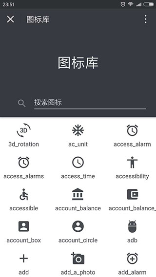
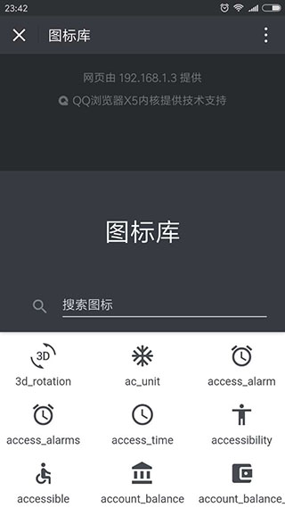

# Intro

> 微信下拉控制，禁用&启用微信下拉效果，如下图所示。




# Api

* pullControl.disable()：禁用微信下拉
* pullControl.enable()：启用微信下拉


# Install
``` sh
$ npm install weixin-pull-control --save
```

# Example

``` js
import pullControl from 'weixin-pull-control'

// 禁用微信下拉
pullControl.disable()

// 10 秒后启用
setTimeout(() => {
    pullControl.enable()
}, 10000)
```
